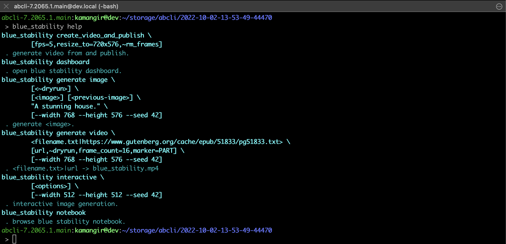
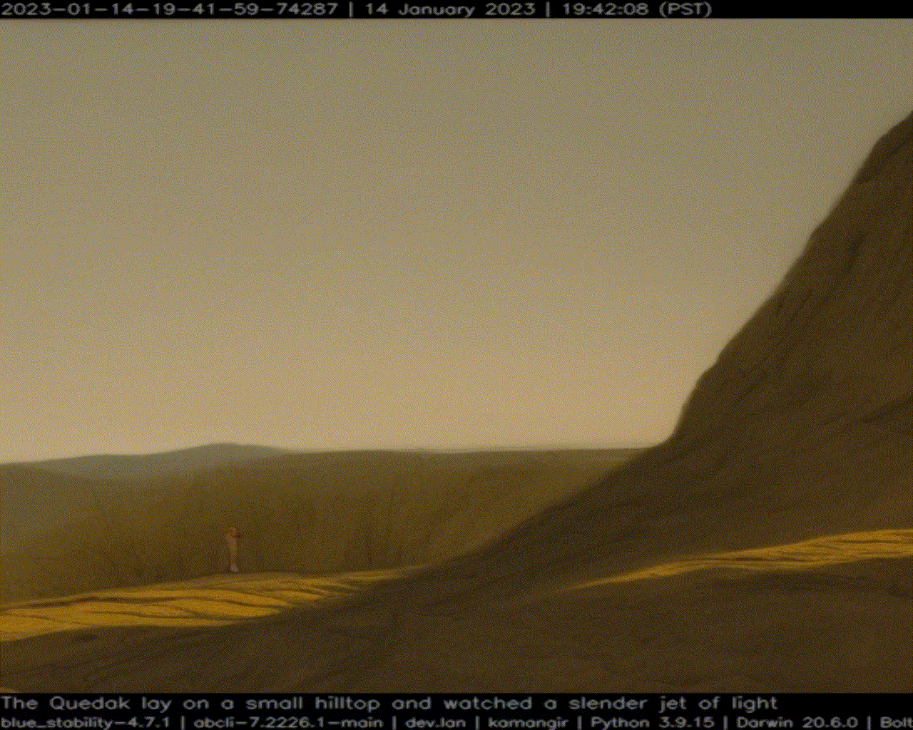

# blue-stability

`blue-stability` (`bstab`) is a bash cli for [stability-sdk](https://github.com/Stability-AI/stability-sdk).

## Install

Install [`awesome-bash-cli`](https://github.com/kamangir/awesome-bash-cli) (`abcli`), then,

```bash
abcli git clone blue-stability install
blue_stability help verbose
```



## Sentence -> Image

```bash
blue_stability generate image \
  ~dryrun,height=576,width=768 \
  carrot.png - \
  "an orange carrot walking on Mars."
```


## Text -> Video

```bash
blue_stability generate video \
  ~dryrun,frame_count=100,marker=PART,url \
  https://www.gutenberg.org/cache/epub/51833/pg51833.txt
```



## Notebook

[](https://colab.research.google.com/github/kamangir/blue-stability/blob/main/nbs/demo_colab.ipynb)

```bash
blue_stability notebook
```
